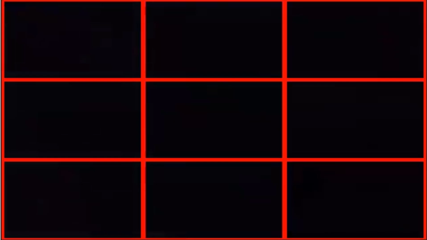
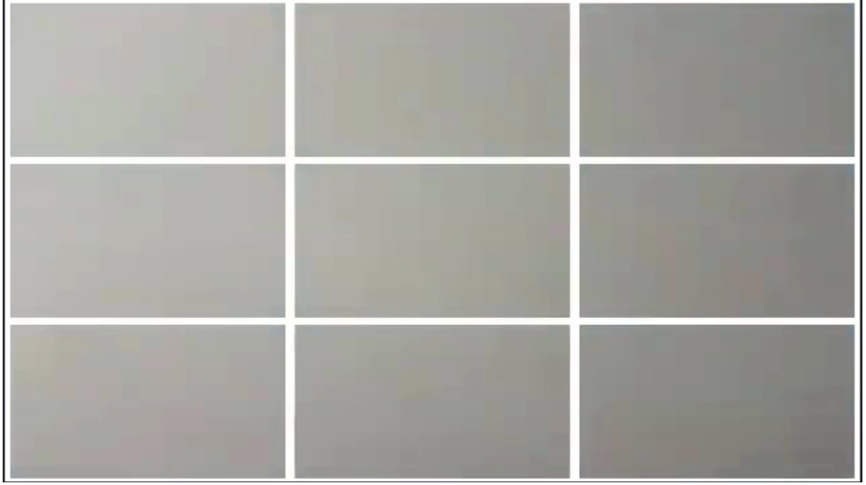
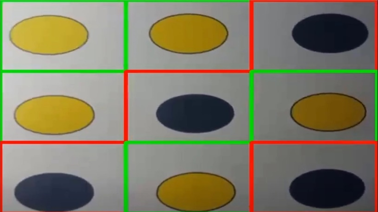
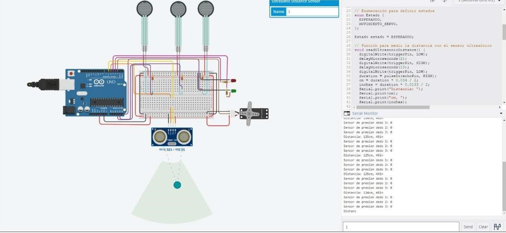
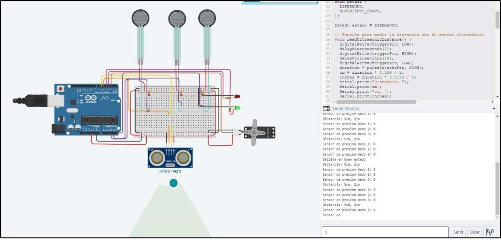
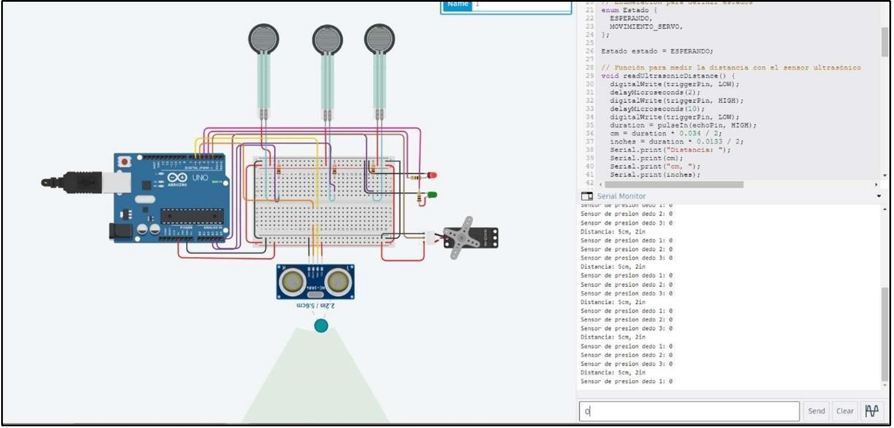
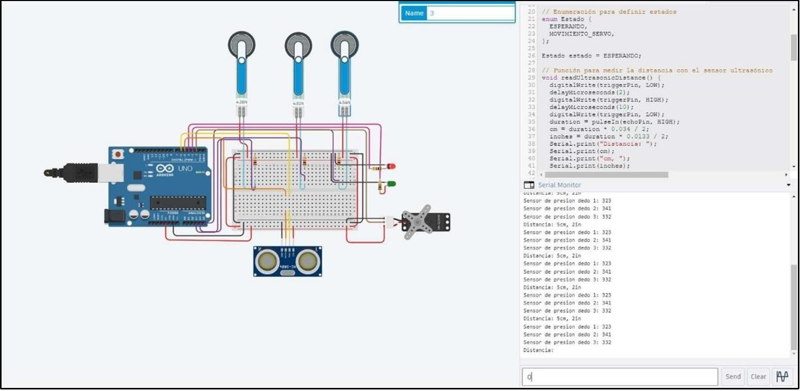

# BurntCookieDetectionPickAndPlace
The Burnt Cookie Detection project aims to develop an automated system to identify overcooked or burnt cookies during the baking process using OpenCV and machine learning algorithms. This system leverages Python 2.7 for image processing and classification, while Arduino is used for interfacing with sensors and controlling the baking process

## Opencv for cookie detection 

The Python code uses OpenCV to process live images from a camera, dividing the screen into a 3x3 grid. Each region is scanned for yellow and black objects using color masks. A previous state is updated and real-time information such as the presence and condition of objects is displayed. Results are printed every 20 seconds, and indicative rectangles are drawn around detected regions. The program runs in a continuous loop until the 'q' key is pressed, at which point camera resources are released and windows are closed. In short, the code allows for the detection and tracking of objects on a screen grid in real-time, offering feedback on their presence and condition.

Therefore, each region can detect 3 possible cases, if it detects a color with the HSV region that corresponds to black, the grid will be red, indicating that there is a burnt cookie in that section, then the case in which all of them detect the black color is presented:

On the other hand, if it does not detect any burnt cookies (represented by the black color), and it does not detect any cookies in good condition (represented by the yellow color), it is assumed that it should not give any result so the grid will be colored white:

Ultimately, when the grid detects yellow, which indicates a good cookie, it will have green borders, below is an example of each grid detecting good cookies and burnt cookies:

## Aurduino usage for grabbing cookies

The behavior of the claw was simulated in such a way that the following conditions are met:
• If the distance from the claw is less than 20 cm, the cookie detection system is activated.
• When a normal cookie is detected, the green LED will light up, and the process ends.
• When a burnt cookie is detected, the red LED will light up, and the servomotor will start to move, simulating the closing of the claw.
• When the 3 pressure sensors detect more than 1 N, the servomotor stops so as not to break the cookie.

Since the distance is greater than 20 cm, the system will not activate the cookie recognition, so the claw will not close.

In this case the distance is greater than 20 cm, therefore, the system recognizes the cookie, if 1 is inserted, it means that the cookie is in good condition, activating the green LED.

When the distance is less than 20cm, and the biscuit is burned, the servo motor will start to move.

When the pressure sensor detects more than 1 N, the servomotor stops moving to avoid breaking the cookie. This pressure will be subsequently analyzed by the control system to avoid breaking cookies.
